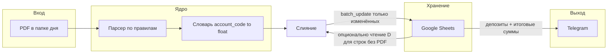

# План переработки Vipiski и структуры проекта

## Текущее состояние

- Один файл [Vipiski_ostatki.py](Vipiski_ostatki.py): копирование PDF из `D:\Выписки\Текущие`, работа с сетевым `Reestr.xlsm` ([xlwings](Vipiski_ostatki.py) + словарь ячеек `cells`), парсинг PDF огромным `if/elif`, запись обратно в Excel, затем `batch_update` в Google (`Account_balances`), депозиты с того же листа, итог в Telegram.
- Не используются в активном коде: `imaplib`, `openpyxl`, `pandas`, `dash`, фактически и `pyodbc` (подключение есть, `execute` закомментирован).
- Риск: в блоке Совкомбанка «ГАСТРОПАРК» пишется в `L24`, что пересекается с другой логикой (Формула ВТБ в словаре `cells` тоже `L24`) — при отказе от Excel конфликт уходит, но при переносе правил в конфиг нужно явно развести **account_id** и целевые ячейки Google.

## Целевая схема потока данных

**Принцип:** Google — источник актуальных остатков. Скрипт **не читает Excel**. Для каждой строки/агрегата в `Account_balances`: если по PDF получено новое значение (или набор субсчетов для формулы) — обновить; иначе **не перезаписывать** ячейку (или один раз прочитать диапазон `D` и подставить только для расчёта текста в Telegram — на выбор реализации).

## Предлагаемая структура каталогов и файлов

| Путь                                 | Назначение                                                                                                                                                                            |
| ------------------------------------ | ------------------------------------------------------------------------------------------------------------------------------------------------------------------------------------- |
| `vipiski/`                           | Пакет приложения                                                                                                                                                                      |
| `vipiski/config.py`                  | Загрузка настроек из env (см. ниже) + дефолты                                                                                                                                         |
| `vipiski/paths.py`                   | Логика `base_path`, `folder_path`, `putdir`, имена месяцев (учесть Windows: локаль `ru_RU` вместо `ru_RU.UTF-8` в try/except)                                                         |
| `vipiski/pdf_ingest.py`              | Копирование из `Текущие`, очистка источника (как сейчас), список PDF                                                                                                                  |
| `vipiski/pdf_text.py`                | Извлечение текста из PDF (обёртка над PyPDF2; место для будущей замены на pdfplumber при проблемах с кодировкой)                                                                      |
| `vipiski/parsers/`                   | Модули по «семействам» выписок: `ukb.py`, `sber.py`, `vtb.py`, `spb.py`, `tochka.py`, `sovcom.py`, `raiffeisen.py` — функции вида `try_parse(text, context) -> Optional[ParseResult]` |
| `vipiski/rules.py`                   | Загрузка списка правил из YAML/JSON: маркер(ы), тип парсера, приоритет, `account_code`                                                                                                |
| `vipiski/engine.py`                  | Проход по PDF: текст → применение правил → словарь `parsed_balances`                                                                                                                  |
| `vipiski/google_sync.py`             | Авторизация gspread, чтение нужного диапазона, сбор `batch_update` из конфигурации «строка/ячейка → формула или список account_code»                                                  |
| `vipiski/deposits.py`                | Текущая логика `deposits_dict` из `get_all_values()`                                                                                                                                  |
| `vipiski/telegram_report.py`         | Формирование текста и отправка (один клиент)                                                                                                                                          |
| `vipiski/logging_setup.py`           | Перенаправление stdout в лог с `try/finally`                                                                                                                                          |
| `main.py`                            | Тонкий entrypoint: конфиг → ingest → engine → google → deposits → telegram                                                                                                            |
| `config/accounts.yaml` (или `.json`) | Правила и привязка к Google-ячейкам; `active: false` для «удалённых» счетов                                                                                                           |
| `requirements.txt`                   | Только реально нужные пакеты                                                                                                                                                          |
| `.env.example`                       | Шаблон переменных без секретов                                                                                                                                                        |

Старый [Vipiski_ostatki.py](Vipiski_ostatki.py) после переноса — удалить или оставить как `legacy_ostatki.py` на один релиз с предупреждением (на усмотрение).

## Конфигурация и секреты (без хардкода)

Вынести в переменные окружения или `.env` (через `python-dotenv`):

- `TELEGRAM_BOT_TOKEN`, `TELEGRAM_CHAT_ID`
- Путь к JSON ключу Google service account
- `GOOGLE_SHEET_NAME`, `GOOGLE_WORKSHEET_BALANCES`
- `VIPISKI_BASE_PATH`, при необходимости переопределение `SRC_CURRENT_DIR` для `Текущие`

**Важно:** текущие токены и пароли в репозитории считать скомпрометированными — ротация токена бота и пароля SQL.

## Этапы работ (порядок выполнения)

1. **Каркас проекта** — создать пакет `vipiski/`, `main.py`, `requirements.txt`, `.env.example`, перенести без изменения логики только блоки: пути, копирование PDF, логирование.
2. **Удалить зависимость от Excel** — убрать `xlwings`, `reestr_dir`, `cells`, все `sheet['L..']` в цикле PDF, `reestr.save/close`, резервное копирование `Reestr*.xlsm`. Парсинг только обновляет in-memory словарь.
3. **Слияние с Google** — описать в конфиге соответствие как сейчас в `updates` ([строки 829–866](Vipiski_ostatki.py)): для каждой целевой ячейки либо один `account_code`, либо список для суммы/формулы. Реализовать: `batch_update` **только** для ячеек, затронутых PDF, **или** полное обновление после чтения текущих D из листа (эквивалент старого поведения, но без Excel).
4. **Декомпозиция парсеров** — не переписывать все regex за раз: вынести тело каждого `elif` в именованную функцию с тегом банка; в `rules.yaml` — строка-сигнатура + имя функции. Новая организация = новая строка в YAML + одна функция (или переиспользование шаблона Сбер/ВТБ).
5. **Депозиты и Telegram** — перенести в отдельные модули; убрать дублирование токена (`send_telegram` в конце файла с тем же токеном — объединить).
6. **Зависимости** — удалить неиспользуемые импорты; рассмотреть замену устаревшего `oauth2client` на `google-auth` + `gspread` (актуальная связка по документации gspread).
7. **SQL Server** — либо удалить подключение до появления задачи, либо оформить отдельным модулем и включать через флаг env (сейчас мёртвый код).

## Критерии готовности

- Запуск одной командой (`python main.py`) с заполненным `.env`.
- Нет обращений к `Reestr.xlsm` и нет `xlwings`/`openpyxl` в зависимостях (если не нужны другим процессам).
- Добавление счёта: правка `accounts.yaml` + при необходимости одна функция парсера; отключение — `active: false`.
- Лог пишется надёжно (восстановление `stdout` в `finally`).

## Риски и смягчение

- **Формулы в Google** с русскими запятыми: сохранить текущую логику `prepare_value` или заменить на вычисление суммы в Python и запись числа (проще отладка, меньше зависимости от локали Sheets).
- **PyPDF2** и порядок страниц: при регрессии — сравнить выборочно старые и новые значения на тестовой копии листа.
- **Имя месяца папки** `strftime("%B")` на английской Windows может дать `March` вместо ожиданий — зафиксировать в конфиге явный шаблон или русские имена через свою таблицу.

